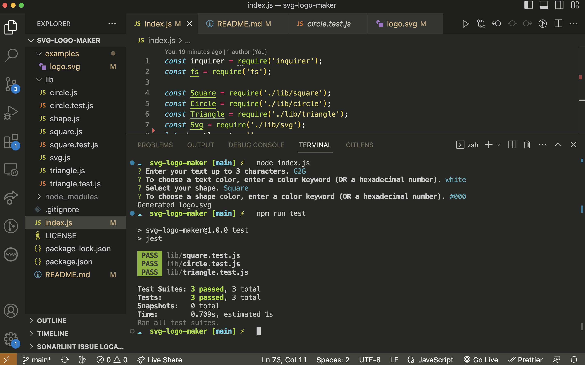

 # SVG Logo Maker

## Description

A command line application that accepts user input to generate an SVG logo. Made with Javascript, node.js, inquirer, and jest.

## Installation

Clone the repo to your local system.

## Usage

[Video Demo](https://drive.google.com/file/d/1nITvIbTKQUxG2bPQucerK5eb8aKrkX4Z/view?usp=share_link)

## License

 

